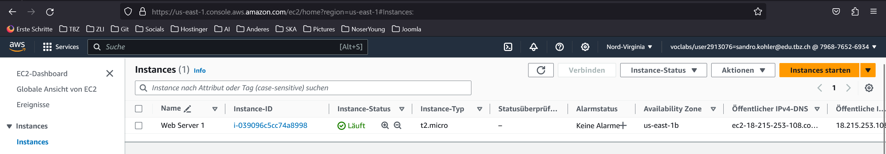
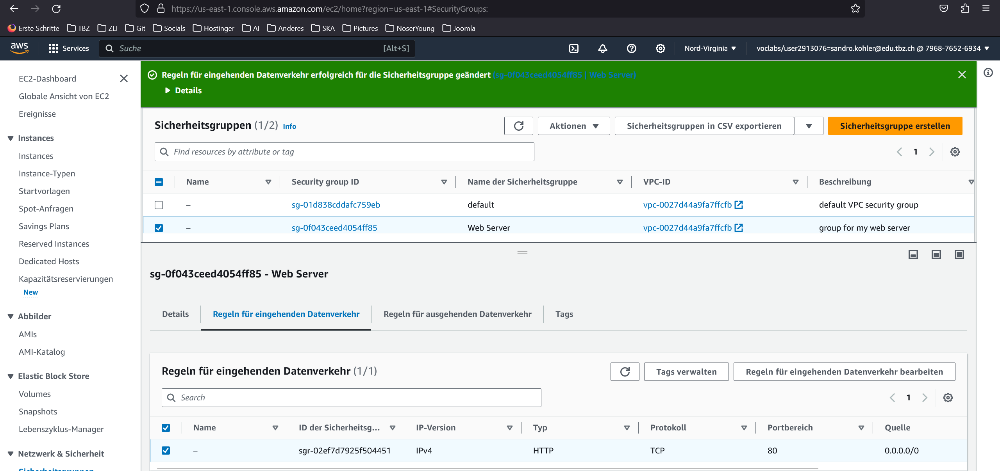
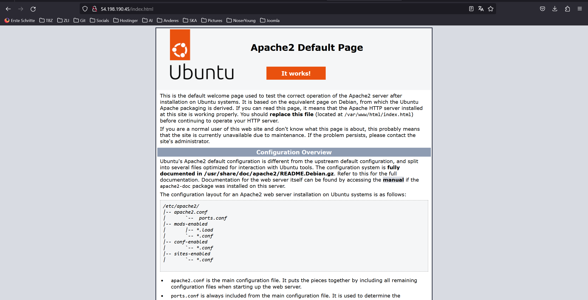
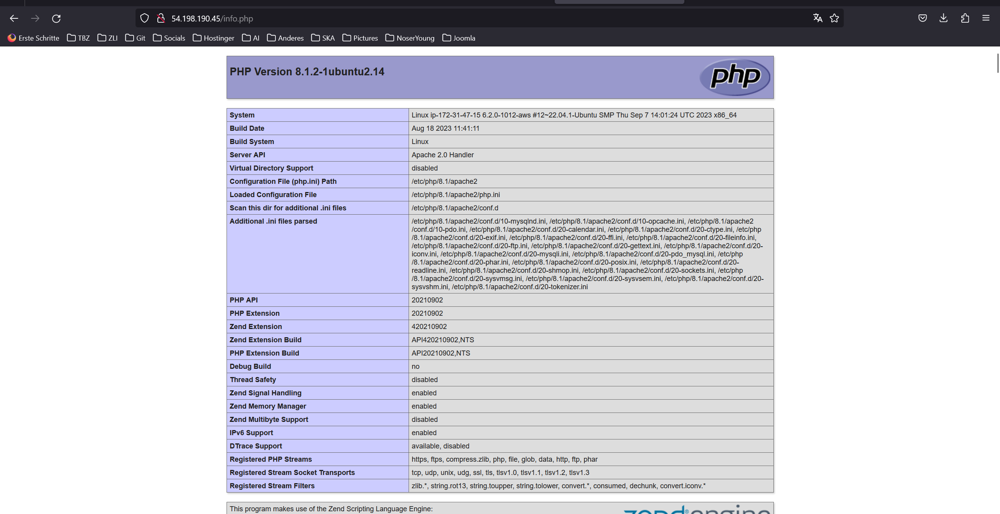
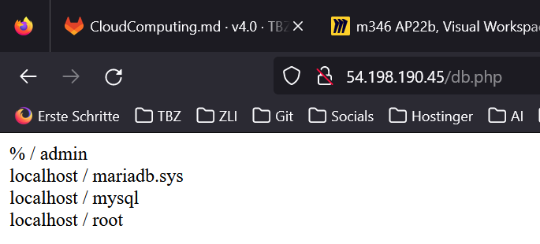

# Abgaben

## A) AWS Kurs

### a) Lab 4.1 - EC2

HTML-Seite, inkl. URL

Liste der EC2-Instanzen

Details der Web Server-Instanz (öffentliche IP sichtbar)
.png)

Security-Group: Liste der Inbound-Regeln.

### b) Lab 4.2 - S3

Liste der Buckets.

HTML-Seite, inkl. URL.

Liste der Dateien im Bucket.

Eigenschaften von "Static website hosting".

JSON-Datei mit der Bucket-Policy für den öffentlichen Zugriff

## B) Zugriff mit SSH-Key

Screenshot mit dem ssh-Befehl und des Resultats unter Verwendung des ersten Schlüssels

Screenshot mit dem ssh-Befehl und des Resultats unter Verwendung des zweiten Schlüssels

Screenshot der Instanz-Detail (oder Liste), so dass der verwendete Schlüssel sichtbar ist.

## C) Installation von Web- und Datenbankserver

Screenshots der funktionierenden Webseiten

index.html

info.php

db.php

