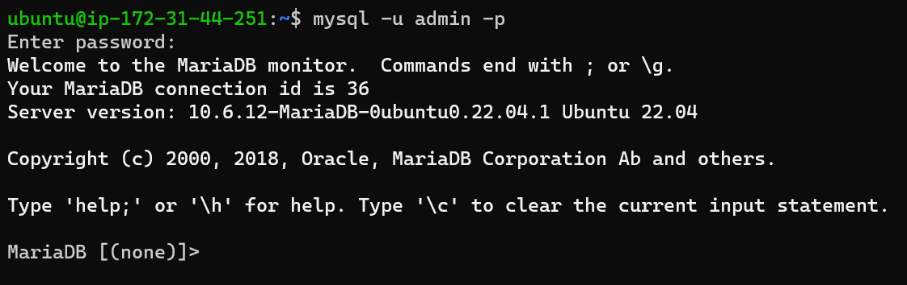
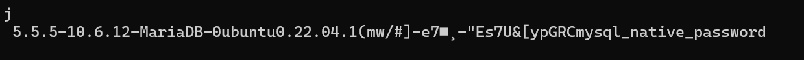
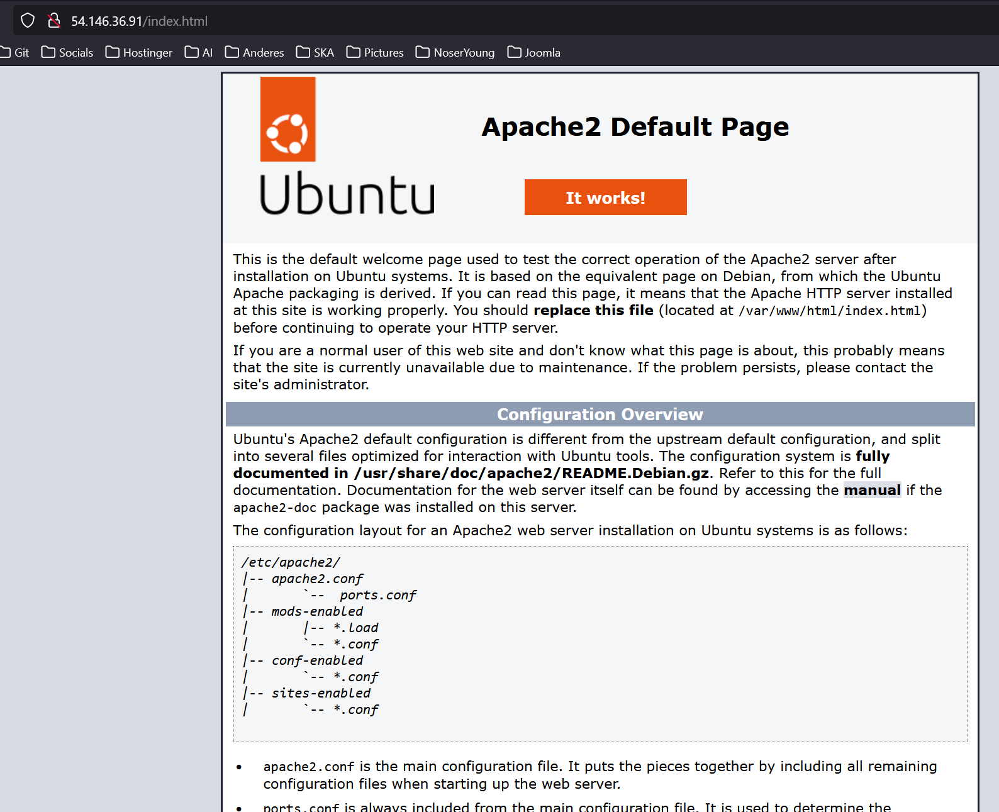
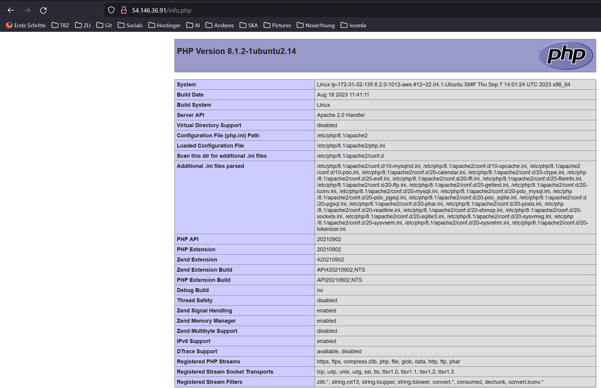
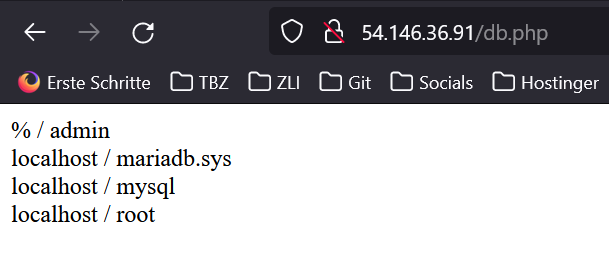
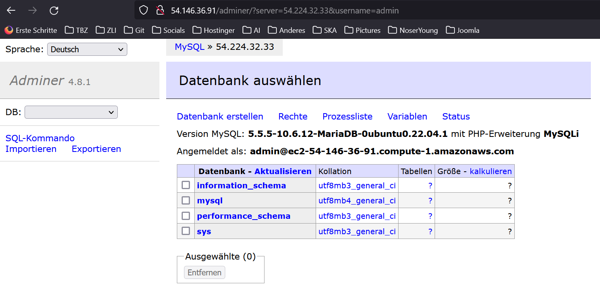

# Abgaben

## Angepasste Cloud-init Konfiguration

```yaml
#cloud-config
users:
  - name: ubuntu # Benutzername
    sudo: ALL=(ALL) NOPASSWD:ALL # sudo-Regeln für diesen Benutzer
    groups: users, admin # Zugehörigkeit zu Benutzergruppen
    home: /home/ubuntu # Verzeichnis des Benutzers
    shell: /bin/bash # Standard-Shell für den Benutzer
    ssh_authorized_keys: # SSH-Schlüssel für den Benutzer
      - ssh-rsa AAAAB3NzaC1yc2EAAAADAQABAAABAQC0WGP1EZykEtv5YGC9nMiPFW3U3DmZNzKFO5nEu6uozEHh4jLZzPNHSrfFTuQ2GnRDSt+XbOtTLdcj26+iPNiFoFha42aCIzYjt6V8Z+SQ9pzF4jPPzxwXfDdkEWylgoNnZ+4MG1lNFqa8aO7F62tX0Yj5khjC0Bs7Mb2cHLx1XZaxJV6qSaulDuBbLYe8QUZXkMc7wmob3PM0kflfolR3LE7LResIHWa4j4FL6r5cQmFlDU2BDPpKMFMGUfRSFiUtaWBNXFOWHQBC2+uKmuMPYP4vJC9sBgqMvPN/X2KyemqdMvdKXnCfrzadHuSSJYEzD64Cve5Zl9yVvY4AqyBD aws-key-nussle
      - ssh-rsa AAAAB3NzaC1yc2EAAAADAQABAAABAQCOO1eV3ywCqD0020KAm6JCApkzPebcJCF0/7nBOo6PluV1+yKfmxPzR3dn/p/33uZQv6SCAb+Iaz9KGtKAUPom8DBk9nWzve02hZ6levGhKey3i0aFCbsd71RdS2DxN3UeL1JZe9jKE67c2Zc3jXoMmF1juTxR+EEeM+lUbN544IG8UIcDtgBsoDqNSnH9FG5NPGCO63ykzFUEU+77LDVS6XF5hWe7v6i+cqENVncKYY3mc9jPeY0BDgniz3KOpBd2/RwfJUMTReG+Cm8zbjGPyxHgUgGtyf18DjQd1Su9Vd1ygL8ADZQuVjtYS9VicmLhlDyGdDxDkB7NOBPJ3QfR aws-key-sandro
ssh_pwauth: false # SSH-Passwort-Authentifizierung deaktivieren
disable_root: false # Root-Benutzer aktivieren
package_update: true # Paketaktualisierung durchführen
packages: # Installierte Pakete
  - curl
  - wget
```

## Details der Instanz


## ssh-Befehl und des Resultats unter Verwendung des ersten Schlüssels


## ssh-Befehl und des Resultats unter Verwendung des zweiten Schlüssels


## Auszug aus dem Cloud-Init-Log


### DB Server





```yaml
#cloud-config
users:
  - name: ubuntu # Benutzername
    sudo: ALL=(ALL) NOPASSWD:ALL # sudo-Regeln für diesen Benutzer
    groups: users, admin # Zugehörigkeit zu Benutzergruppen
    home: /home/ubuntu # Verzeichnis des Benutzers
    shell: /bin/bash # Standard-Shell für den Benutzer
    ssh_authorized_keys: # SSH-Schlüssel für den Benutzer
      - ssh-rsa AAAAB3NzaC1yc2EAAAADAQABAAABAQC0WGP1EZykEtv5YGC9nMiPFW3U3DmZNzKFO5nEu6uozEHh4jLZzPNHSrfFTuQ2GnRDSt+XbOtTLdcj26+iPNiFoFha42aCIzYjt6V8Z+SQ9pzF4jPPzxwXfDdkEWylgoNnZ+4MG1lNFqa8aO7F62tX0Yj5khjC0Bs7Mb2cHLx1XZaxJV6qSaulDuBbLYe8QUZXkMc7wmob3PM0kflfolR3LE7LResIHWa4j4FL6r5cQmFlDU2BDPpKMFMGUfRSFiUtaWBNXFOWHQBC2+uKmuMPYP4vJC9sBgqMvPN/X2KyemqdMvdKXnCfrzadHuSSJYEzD64Cve5Zl9yVvY4AqyBD aws-key-nussle
      - ssh-rsa AAAAB3NzaC1yc2EAAAADAQABAAABAQCOO1eV3ywCqD0020KAm6JCApkzPebcJCF0/7nBOo6PluV1+yKfmxPzR3dn/p/33uZQv6SCAb+Iaz9KGtKAUPom8DBk9nWzve02hZ6levGhKey3i0aFCbsd71RdS2DxN3UeL1JZe9jKE67c2Zc3jXoMmF1juTxR+EEeM+lUbN544IG8UIcDtgBsoDqNSnH9FG5NPGCO63ykzFUEU+77LDVS6XF5hWe7v6i+cqENVncKYY3mc9jPeY0BDgniz3KOpBd2/RwfJUMTReG+Cm8zbjGPyxHgUgGtyf18DjQd1Su9Vd1ygL8ADZQuVjtYS9VicmLhlDyGdDxDkB7NOBPJ3QfR aws-key-sandro
ssh_pwauth: false # SSH-Passwort-Authentifizierung deaktivieren
disable_root: false # Root-Benutzer aktivieren
package_update: true # Paketaktualisierung durchführen
packages: # Installierte Pakete
  - mariadb-server

runcmd:
  - sudo mysql -sfu root -e "GRANT ALL ON *.* TO 'admin'@'%' IDENTIFIED BY 'password' WITH GRANT OPTION;"
  - sudo sed -i 's/127.0.0.1/0.0.0.0/g' /etc/mysql/mariadb.conf.d/50-server.cnf
  - sudo systemctl restart mariadb.service

```

### Webserver









```yaml
#cloud-config
users:
  - name: ubuntu # Benutzername
    sudo: ALL=(ALL) NOPASSWD:ALL # sudo-Regeln für diesen Benutzer
    groups: users, admin # Zugehörigkeit zu Benutzergruppen
    home: /home/ubuntu # Verzeichnis des Benutzers
    shell: /bin/bash # Standard-Shell für den Benutzer
    ssh_authorized_keys: # SSH-Schlüssel für den Benutzer
      - ssh-rsa AAAAB3NzaC1yc2EAAAADAQABAAABAQC0WGP1EZykEtv5YGC9nMiPFW3U3DmZNzKFO5nEu6uozEHh4jLZzPNHSrfFTuQ2GnRDSt+XbOtTLdcj26+iPNiFoFha42aCIzYjt6V8Z+SQ9pzF4jPPzxwXfDdkEWylgoNnZ+4MG1lNFqa8aO7F62tX0Yj5khjC0Bs7Mb2cHLx1XZaxJV6qSaulDuBbLYe8QUZXkMc7wmob3PM0kflfolR3LE7LResIHWa4j4FL6r5cQmFlDU2BDPpKMFMGUfRSFiUtaWBNXFOWHQBC2+uKmuMPYP4vJC9sBgqMvPN/X2KyemqdMvdKXnCfrzadHuSSJYEzD64Cve5Zl9yVvY4AqyBD aws-key-nussle
      - ssh-rsa AAAAB3NzaC1yc2EAAAADAQABAAABAQCOO1eV3ywCqD0020KAm6JCApkzPebcJCF0/7nBOo6PluV1+yKfmxPzR3dn/p/33uZQv6SCAb+Iaz9KGtKAUPom8DBk9nWzve02hZ6levGhKey3i0aFCbsd71RdS2DxN3UeL1JZe9jKE67c2Zc3jXoMmF1juTxR+EEeM+lUbN544IG8UIcDtgBsoDqNSnH9FG5NPGCO63ykzFUEU+77LDVS6XF5hWe7v6i+cqENVncKYY3mc9jPeY0BDgniz3KOpBd2/RwfJUMTReG+Cm8zbjGPyxHgUgGtyf18DjQd1Su9Vd1ygL8ADZQuVjtYS9VicmLhlDyGdDxDkB7NOBPJ3QfR aws-key-sandro
ssh_pwauth: false # SSH-Passwort-Authentifizierung deaktivieren
disable_root: false # Root-Benutzer aktivieren
package_update: true # Paketaktualisierung durchführen
packages: # Installierte Pakete
  - curl
  - wget
  - apache2
  - php
  - libapache2-mod-php
  - adminer
  - php-mysqli

runcmd:
  - sudo a2enconf adminer
  - sudo systemctl restart apache2

# PHP-Dateien erstellen
write_files:
  - path: /var/www/html/db.php
    content: |
      <?php
        $servername = "54.224.32.33";
        $username = "admin";
        $password = "password";
        $dbname = "mysql";

        // Create connection
        $conn = new mysqli($servername, $username, $password, $dbname);
        // Check connection
        if ($conn->connect_error) {
                die("Connection failed: " . $conn->connect_error);
        }

        $sql = "select Host, User from mysql.user;";
        $result = $conn->query($sql);
        while($row = $result->fetch_assoc()){
                echo($row["Host"] . " / " . $row["User"] . "<br />");
        }
        //var_dump($result);
      ?>
  - path: /var/www/html/info.php
    content: |
      <?php

      // Show all information, defaults to INFO_ALL
      phpinfo();

      ?>
```
