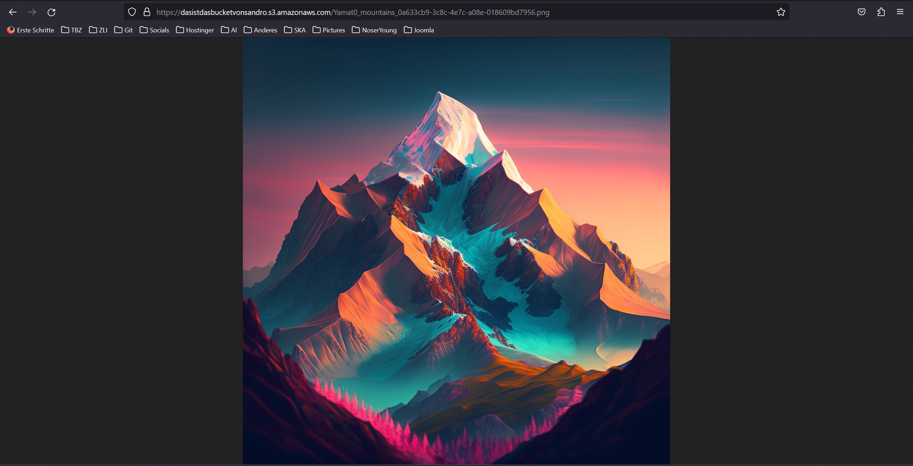

# Abgaben Bild erstellen und auf S3 hosten

## Bild erstellen und auf S3 hosten




##  Web-Server mit PHP-Seite hinzufügen


```yaml
#cloud-config
users:
  - name: ubuntu # Benutzername
    sudo: ALL=(ALL) NOPASSWD:ALL # sudo-Regeln für diesen Benutzer
    groups: users, admin # Zugehörigkeit zu Benutzergruppen
    home: /home/ubuntu # Verzeichnis des Benutzers
    shell: /bin/bash # Standard-Shell für den Benutzer
    ssh_authorized_keys: # SSH-Schlüssel für den Benutzer
      - ssh-rsa AAAAB3NzaC1yc2EAAAADAQABAAABAQC0WGP1EZykEtv5YGC9nMiPFW3U3DmZNzKFO5nEu6uozEHh4jLZzPNHSrfFTuQ2GnRDSt+XbOtTLdcj26+iPNiFoFha42aCIzYjt6V8Z+SQ9pzF4jPPzxwXfDdkEWylgoNnZ+4MG1lNFqa8aO7F62tX0Yj5khjC0Bs7Mb2cHLx1XZaxJV6qSaulDuBbLYe8QUZXkMc7wmob3PM0kflfolR3LE7LResIHWa4j4FL6r5cQmFlDU2BDPpKMFMGUfRSFiUtaWBNXFOWHQBC2+uKmuMPYP4vJC9sBgqMvPN/X2KyemqdMvdKXnCfrzadHuSSJYEzD64Cve5Zl9yVvY4AqyBD aws-key-nussle
      - ssh-rsa AAAAB3NzaC1yc2EAAAADAQABAAABAQCOO1eV3ywCqD0020KAm6JCApkzPebcJCF0/7nBOo6PluV1+yKfmxPzR3dn/p/33uZQv6SCAb+Iaz9KGtKAUPom8DBk9nWzve02hZ6levGhKey3i0aFCbsd71RdS2DxN3UeL1JZe9jKE67c2Zc3jXoMmF1juTxR+EEeM+lUbN544IG8UIcDtgBsoDqNSnH9FG5NPGCO63ykzFUEU+77LDVS6XF5hWe7v6i+cqENVncKYY3mc9jPeY0BDgniz3KOpBd2/RwfJUMTReG+Cm8zbjGPyxHgUgGtyf18DjQd1Su9Vd1ygL8ADZQuVjtYS9VicmLhlDyGdDxDkB7NOBPJ3QfR aws-key-sandro
ssh_pwauth: false # SSH-Passwort-Authentifizierung deaktivieren
disable_root: false # Root-Benutzer aktivieren
package_update: true # Paketaktualisierung durchführen
packages: # Installierte Pakete
  - curl
  - wget
  - apache2
  - php
  - libapache2-mod-php

# Datei für PHP-Dateien erstellen
write_files:
  - path: /var/www/html/image.php
    content: |
      <?php $ihrname = "Sandro Kohler"; ?>
      <html>

      <head>
          <title>
              <?php echo ($ihrname) ?>
          </title>
      </head>

      <body>
          Berg mit Schnee, welcher rot von beleuchtet wird.
          <br />
          

          Bild wurde mit Midjourney generiert.
      </body>

      </html>

```

##  Elastic Block Storage (EBS) hinzufügen


## Speichereigenschaften

|            | Typ        | Persistenz |
| ---------- | ---------- | ---------- |
| EBS Root   |Hot         | Nein         |
| EBS Zusätzliches Volumen|Hot |Ja     |
| S3         |Warm         |Ja         |

Die beiden EBS Volumen werden als Hot eingestuft, weil sie für Workloads mit hoher I/O-Leistung ausgelegt sind, das S3 ist einfach nicht so schnell. Die Persistenzen sind bei S3 & EBS auf Ja, weil die Daten auch nach dem Beenden der EC2-Instanz erhalten bleiben. Beim EBS Root werden die Daten mit der EC2 Instanz gelöscht.
