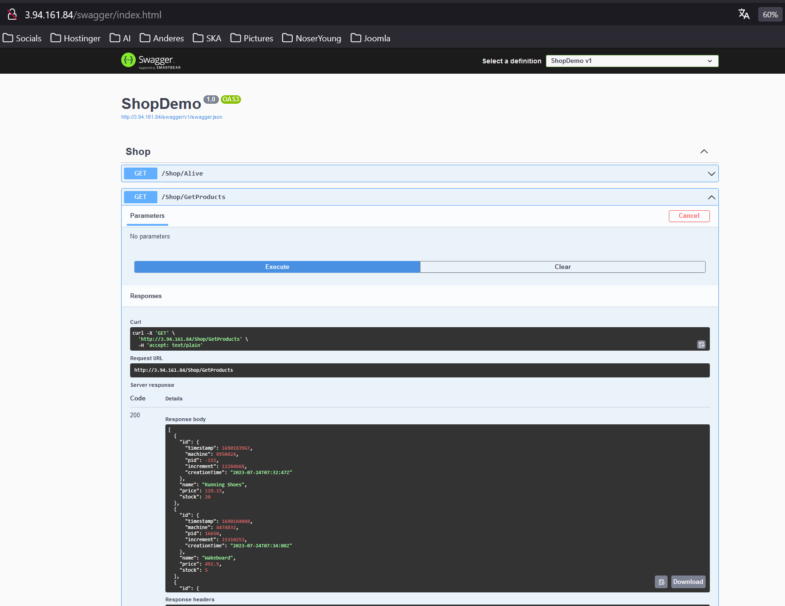

# Abgaben

## Installation App

### Kurze Erklärung in eigenen Worten was ein Reverse Proxy ist

Ein Reverse Proxy nimmt Anfragen von Benutzern entgegen und leitet sie an den richtigen Server weiter, ohne zu verraten, woher die Informationen ursprünglich kommen. So kann ein Reverse Proxy dazu beitragen, die Server sicher und geheim zu halten, während er den Benutzern hilft, die Informationen zu bekommen.

### Endpoint mit Swagger aufrufen

### Screenshot einer der MongoDB Collections mit Auszug aus dem Inhalt

## Vertikale Skalierung

### Erklärungen

Um die Disk auf 20GB zu erweitern, muss man unter Volumes, bei Aktionen "Volume Ändern" auswählen und den Speicher erhöhen, dabei muss die Instanz nicht gestoppt werden.

Um den Instanz-Typ zu ändern, muss die Instanz gestoppt werden, dann kann man bei den Aktionen "Instance-Einstellungen" auswählen und dort "Instance-Typ ändern" anklicken, anschliessend kann der neue Instanz Typ ausgewählt und angewendet werden.

## Horizontale Skalierung

## Auto Scaling
