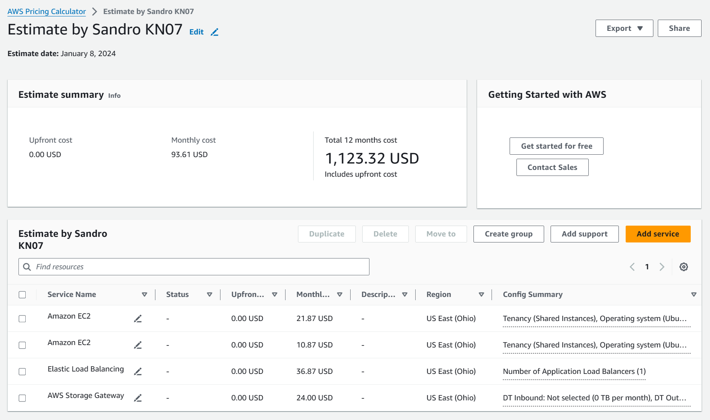
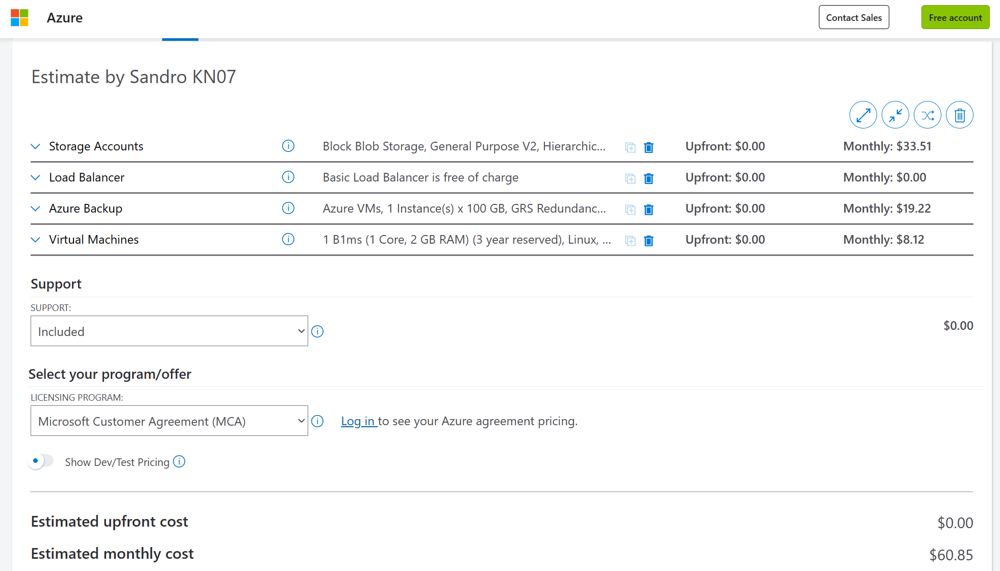
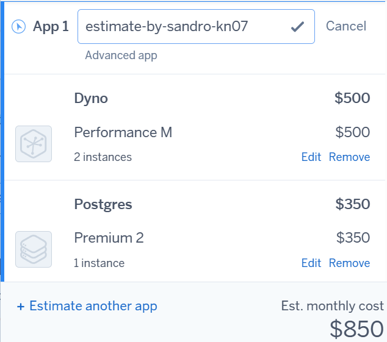
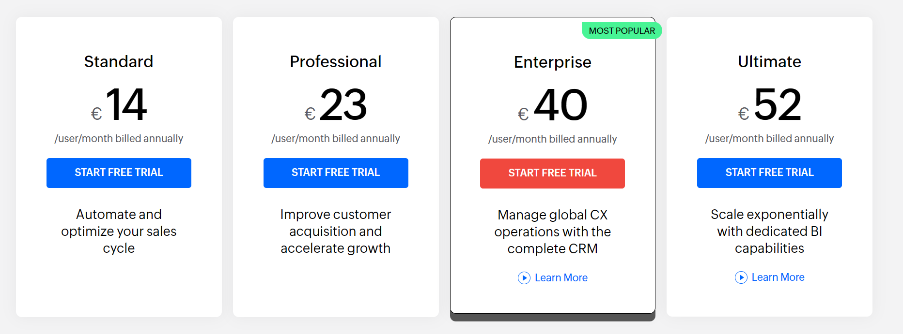
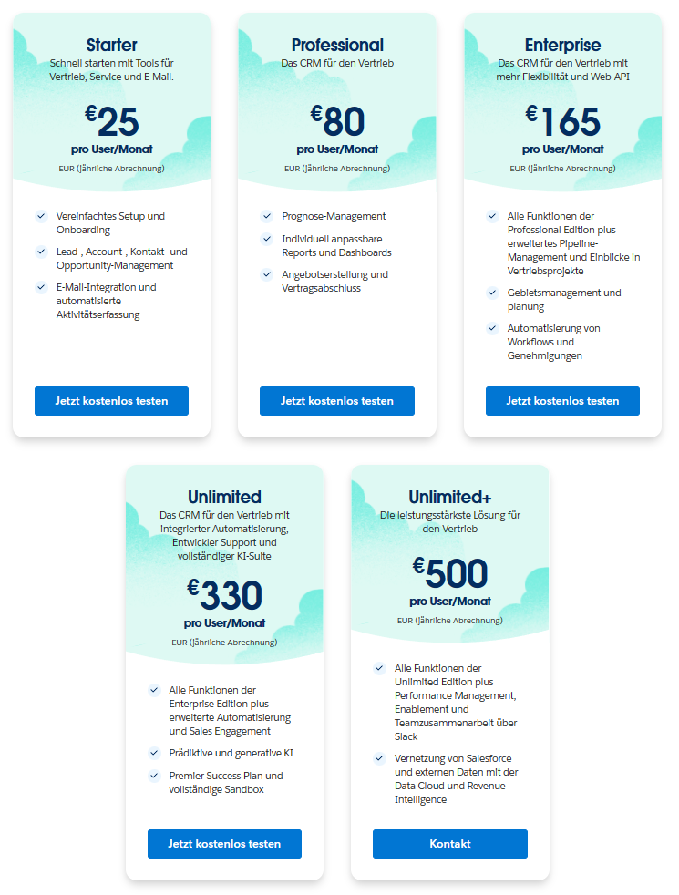

# Abgaben

## A Kostenrechnung erstellen

### 1 Rehosting

#### AWS

#### Azure

#### Erklärung 1

Obwohl Azure günstiger ist als AWS würde ich AWS bevorzugen, da ich mehr Erfahrung mit AWS habe und sagen kann das AWS eine einfache Bedienung hat.

### 2 Replatforming

#### Heroku

#### Erklärung 2

Bisher habe ich wenig mit Heroku gemacht, es ist teurer als AWS und Azure, man ist eingeschränkter bei der Modifizierung, muss aber auch selbst weniger machen, da Heroku einiges übernimt.

### 3 Repurchasing

#### Zoho CRM

#### SalesForce Sales Cloud

#### Erklärung 3

Bei Zoho ist es viel übersichtlicher was man für sein Geld bekommt und man bekommt soweit ich sehe auch mehr für sein Geld. So bekommt man für 40€ schon fast alle Features (ausser ein Feature) bei Zoho, während man bei SalesForce viel mehr bezahlen muss, um annährend alle Features zu bekommen. Deshalb würde ich Zoho wählen.

#### Gegenüberstellung

Ich würde Rehosting, also IaaS wählen, weil es am günstigsten ist und man am meisten Kontrolle hat. Die Nachteile sind, dass man mehr machen muss als bei SaaS und PaaS, so kann es sein das sich Repurchasing mit Zoho mehr lohnen würde, weil es bei wenig Mitarbeiter günstiger sein kann, als IaaS und PaaS. PaaS, also Heroku würde ich nicht wählen, weil es zu teuer ist und es sein kann das die App angepasst werden muss, um sie auf Heroku zu deployen.

## B Interpretation der Resultate

Die Angebote unterscheiden sich relativ stark, da verschiedene Faktoren einfluss nehmen. So ist es bei SaaS sehr entscheidend wie viele Mitarbeiter man hat, da jeder einzelne Mitarbeiter mehr kostet, was bei IaaS und PaaS nicht der Fall ist. Wobei man bei IaaS vieles selbst anpassen kann und somit personalisieren kann, was aber auch wieder mehr Aufwand ergibt. Bei PaaS muss man die App evt. anpassen, da man die einzelnen Sachen nicht so gut wie bei IaaS bestimmen kann, aber man hat auch weniger Arbeit da einem einiges abgenommen wird, aber halt nicht alles wie bei SaaS, was aber nicht wirklich anpassbar ist.

IaaS ist am günstigsten soweit man es auf den Preis vom Service bezieht, so muss man ja auch noch die Mitarbeiter bezahlen, welche das ganze konfigurieren müssen, so kann es auch sein das es günstiger kommt wenn man PaaS oder SaaS nimmt.

Bei 16 Mitarbeiter auf 330€ pro User/Monat (Unlimited SalesForce Sales Cloud) kann es schon sehr teuer werden (5,280€), aber auch wieder relativ günstig (224€) mit 14€ pro User/Monat (Standard Zoho). Egal welche Variante man von SaaS nimmt es ist einfach mit weniger Arbeit & Personalisierung zu rechnen. Wobei man bei PaaS, was mehr oder weniger kosten kann als SaaS, mehr Arbeit und mehr Personalisierung.
