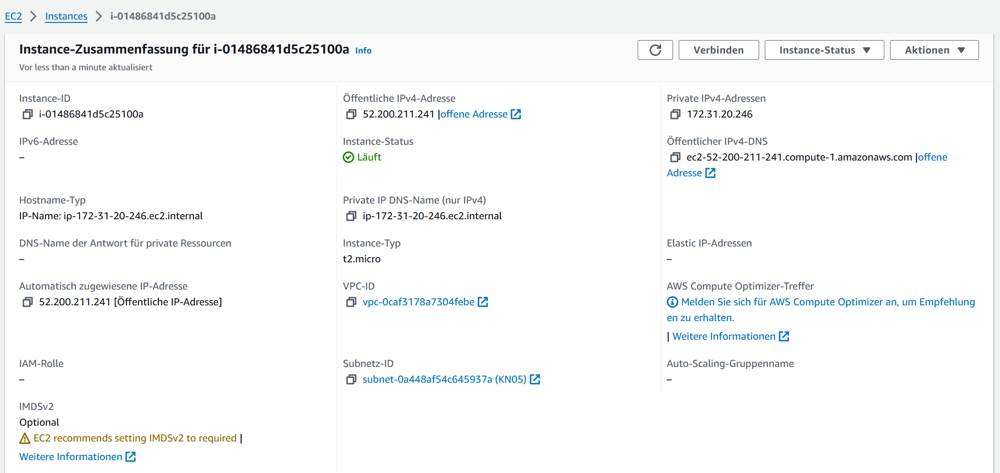
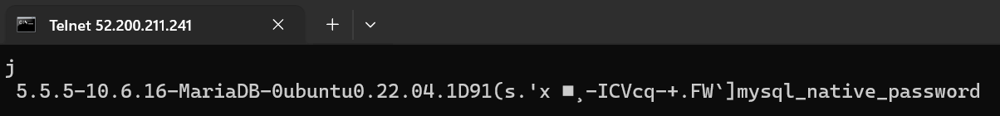

# Abgaben

## Automatisierung mit Command Line Interface

### Stoppen einer Instanz (nicht terminieren)

```aws ec2 stop-instances --instance-ids i-032e53779198acd73 --region us-east-1```


### Starten der gleichen Instanz

```aws ec2 start-instances --instance-ids i-032e53779198acd73 --region us-east-1```


### Erstellen einer neuen Instanz

```bash
aws ec2 run-instances --image-id ami-0c7217cdde317cfec --count 1 --instance-type t2.micro --key-name Sandro-1 --security-group-ids sg-00d2c50f3e7ad5378 --subnet-id subnet-0a448af54c645937a --user-data file://C:/020.Berufsschule/m346/KN09/cloud-init-db.yaml  --region us-east-1
```





### Liste der Befehle

#### Subnet erstellen

```bash
aws ec2 create-subnet --vpc-id VPC_ID --cidr-block 10.0.3.0/24 --subnet-name Subnet-KN09
```

#### Security Group erstellen

```bash
aws ec2 create-security-group --group-name WEB-SG --description "Security Group for Web" --vpc-id vpc-00fad79e0fa72f1dc aws ec2 create-security-group --group-name DB-SG --description "Security Group for DB" --vpc-id vpc-00fad79e0fa72f1dc
```

#### Regeln für DB Security Group aktualisieren

```bash
aws ec2 authorize-security-group-ingress --group-id DB_SG_ID --protocol tcp --port 3306 --source-prefix-list YOUR_SUBNET_CIDR
```

#### Instanzen erstellen

```bash
aws ec2 run-instances --image-id AMI_ID --subnet-id sg-0b8500efb36934160 --instance-type t2.micro --key-name KEY_PAIR --security-group-ids WEB_SG_ID --private-ip-address $PrivateIP1
```

```bash
aws ec2 run-instances --image-id AMI_ID --subnet-id sg-0b8500efb36934160 --instance-type t2.micro --key-name KEY_PAIR --security-group-ids DB_SG_ID --private-ip-address $PrivateIP2
```

#### Elastische IP-Adresse zuweisen

```bash
aws ec2 allocate-address --domain vpc --output json
```

#### Instanzen stoppen

```bash
aws ec2 stop-instances --instance-ids INSTANCE_ID_1 INSTANCE_ID_2
```

### Automatisierung

Um die Befehle automatisiert auszuführen, muss man noch Private IPs auswählen und als Variablen definieren:
``PrivateIP1="10.0.1.10"``
``PrivateIP2="10.0.2.10"``
Danach kann man mit einem Skript die Befehle in einer Datei automatisch ausführen.
