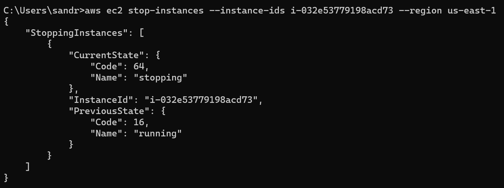
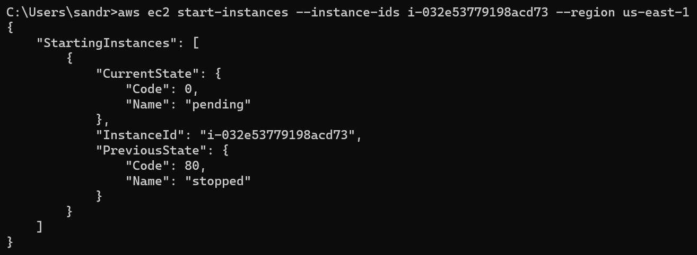

# Abgaben

## Automatisierung mit Command Line Interface

### Stoppen einer Instanz (nicht terminieren)

```aws ec2 stop-instances --instance-ids i-032e53779198acd73 --region us-east-1```



### Starten der gleichen Instanz

```aws ec2 start-instances --instance-ids i-032e53779198acd73 --region us-east-1```



### Erstellen einer neuen Instanz

```aws ec2 run-instances --image-id <AMI-ID> --count 1 --instance-type <Instance-Typ> --key-name <Schlüsselpaar-Name> --security-group-ids <Sicherheitsgruppen-ID> --subnet-id <Subnetz-ID> --user-data file://<Pfad-zur-Cloud-Init-Datei>```
