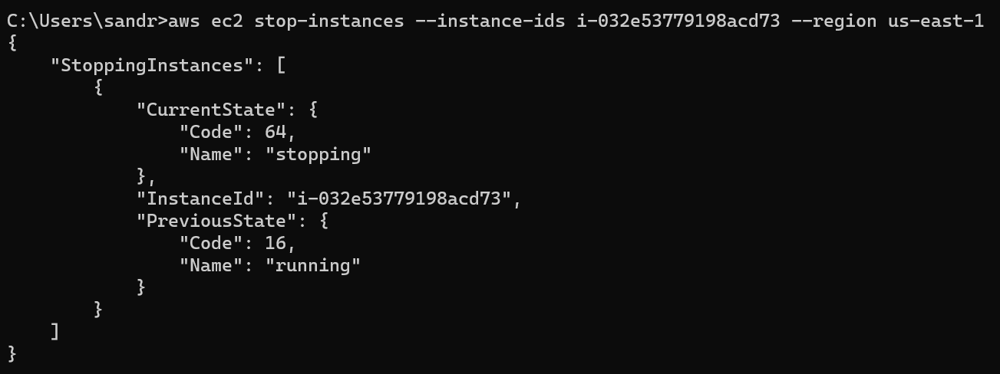
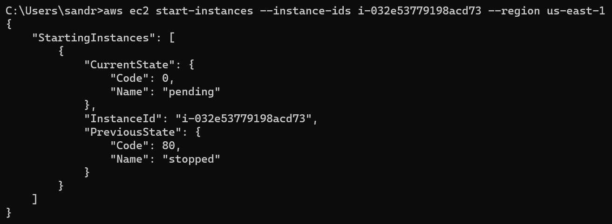

# Abgaben

## Automatisierung mit Command Line Interface

### Stoppen einer Instanz (nicht terminieren)

```aws ec2 stop-instances --instance-ids i-032e53779198acd73 --region us-east-1```



### Starten der gleichen Instanz

```aws ec2 start-instances --instance-ids i-032e53779198acd73 --region us-east-1```



### Erstellen einer neuen Instanz

```bash
aws ec2 run-instances --image-id ami-0c7217cdde317cfec --count 1 --instance-type t2.micro --key-name Sandro-1 --security-group-ids sg-00d2c50f3e7ad5378 --subnet-id subnet-0a448af54c645937a --user-data cloud-init-db.yaml  --region us-east-1
```
